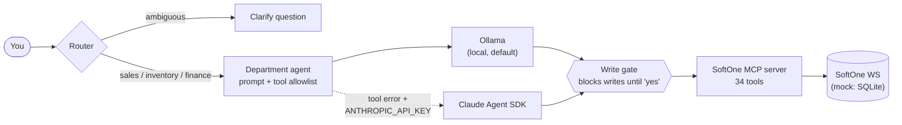

# SoftOne Agent Platform

[](https://github.com/leonlongtang/softone-api-wrapper/actions/workflows/ci.yml)

**Talk to an ERP safely.** A LangGraph router sends each request to a sales, inventory or finance agent. Each agent
can only use its own slice of 34 MCP tools over the SoftOne ERP, and **no agent can change data until you say yes**.
That last rule is enforced in code, not in a prompt. It runs on a local model (Ollama) and escalates a failed turn
to Claude.



## Demo

A real, unedited run on the mock ERP (`--runtime claude`; only your typed lines are inserted and a Claude CLI
login notice removed). Every write is blocked and shown verbatim until you say yes; "Invoice that order" is
routed to finance, which still knows it means order 5006.

**Fully local works too.** The same six-turn script on Ollama with `qwen2.5:7b` passed 3 out of 3 runs, checked
against the database: order 5006 confirmed, one $1,250 invoice, no duplicate writes. That was on a laptop with a
GTX 1650 (4 GB) and 8 GB RAM, at about 5½ minutes per run.

```text
You: Create an order for customer 47: 1x item 1001 and 2x item 1002
[sales | claude] **Order Summary - Ready for Approval**

I'm about to create a **new sales order** with the following details:

| Field | Value |
|-------|-------|
| **Customer** | Customer ID 47 |
| **Item 1** | Item 1001 × 1 |
| **Item 2** | Item 1002 × 2 |
| **Status** | Draft (pending approval) |
| **Action** | Reserve inventory for these items and calculate order total |

**Please reply "yes" to approve this order creation.**

Needs your approval:
  - create_order({"customer_id": 47, "items": [{"item_id": 1001, "quantity": 1}, {"item_id": 1002, "quantity": 2}]})
Reply `yes` to run it.

You: yes
[sales | claude] **✓ Order Created Successfully**

| Field | Value |
|-------|-------|
| **Order ID** | 5006 |
| **Customer** | 47 |
| **Status** | Draft |
| **Created** | 2026-10-07 12:46:07 |

**Order Lines:**
1. Item 1001 — Laptop 14 inch  
   Qty: 1 @ $1,200.00 = **$1,200.00**

2. Item 1002 — Wireless Mouse  
   Qty: 2 @ $25.00 = **$50.00**

**Order Total: $1,250.00**

The order is now in **Draft** status. You can edit it further or approve it when ready. Would you like me to approve this order or make any changes?

You: Approve it
[sales | claude] **Approve Order 5006 - Confirmation Required**

This action will:
- **Move order 5006 from Draft → Confirmed status**
- **Lock the order** (no further edits allowed)
- **Enable invoice generation** for this confirmed order

**Please reply "yes" to confirm approval.**

Needs your approval:
  - approve_order({"order_id": 5006})
Reply `yes` to run it.

You: yes
[sales | claude] **✓ Order Approved Successfully**

Order **5006** has been moved to **Confirmed** status.

| Field | Value |
|-------|-------|
| **Order ID** | 5006 |
| **Customer** | 47 |
| **Status** | ✓ Confirmed |
| **Total** | $1,250.00 |

The order is now locked and ready for invoicing. You can generate an invoice whenever you're ready!

You: Invoice that order
[finance | claude] **Create Invoice - Confirmation Required**

This action will:
- **Generate invoice from order 5006**
- **Customer ID:** 47
- **Invoice amount:** $1,250.00
- **Payment terms:** Net 30 (due ~2026-11-06)
- **Deduct inventory:** 1x Item 1001, 2x Item 1002
- **Invoice status:** Unpaid

**Please reply "yes" to confirm invoice creation.**

Needs your approval:
  - create_invoice({"order_id": 5006, "payment_terms": "net_30"})
Reply `yes` to run it.

You: yes
[finance | claude] **✓ Invoice Created Successfully**

| Field | Value |
|-------|-------|
| **Invoice ID** | 6 |
| **Order ID** | 5006 |
| **Customer ID** | 47 |
| **Amount** | $1,250.00 |
| **Status** | Unpaid |
| **Created** | 2026-10-07 12:46:23 |
| **Payment Terms** | Net 30 |
| **Due Date** | 2026-11-06 |

Inventory has been deducted for the ordered items. The invoice is now issued and awaiting payment.
```

## Quickstart

Runs entirely on a seeded mock ERP: no SoftOne account and no API key needed.

```bash
git clone https://github.com/leonlongtang/softone-api-wrapper && cd softone-api-wrapper
uv sync                          # or: python -m venv .venv && pip install -e . pytest
uv run pytest -q                 # 128 tests, ~3s, no LLM needed

ollama pull qwen2.5:7b           # tested default (4.7 GB); other tool-calling models: set OLLAMA_MODEL
uv run python -m agent_platform                                   # chat
uv run python -m agent_platform "List unpaid invoices for customer 47"   # one turn
uv run python -m agent_platform --runtime claude "..."            # Claude only (needs ANTHROPIC_API_KEY)
```

Configuration is optional: copy `.env.example` to `.env` to set a model, an API key, or real SoftOne credentials.

**Choosing a local model.** On 8 GB RAM / 4 GB VRAM, about 8B parameters is the practical ceiling. `qwen3:8b`
answered correctly in a spot check, but its built-in reasoning made that turn about 3× slower than `qwen2.5:7b`
on the test laptop, so `qwen2.5:7b` stays the default. With more memory, larger tool-calling models are worth
trying via `OLLAMA_MODEL`.

## How it works

| Term | Meaning |
|---|---|
| **Department agent** | `sales`, `inventory` or `finance`: a system prompt plus an allowlist of MCP tools ([`specs.py`](agent_platform/specs.py)). |
| **Route** | The router's decision per turn: a department, or *clarify* when signals conflict ([`router.py`](agent_platform/router.py)). Follow-ups like "yes" stay with the current department. |
| **Runtime** | The model backend running an agent: Ollama or the Claude Agent SDK ([`runtimes/`](agent_platform/runtimes)). |
| **Escalation** | A turn whose tool call fails on Ollama is rerun on Claude, if a key is set ([`graph.py`](agent_platform/graph.py)). |

**Write gate** ([`gate.py`](agent_platform/gate.py)): every write tool call is blocked and shown to you verbatim.
If your next message starts with *yes*, exactly those tools may run once each. Any other reply cancels them.
Ollama's tool wrapper and Claude's `can_use_tool` both enforce it, and a test fails if a new MCP tool is
neither a known write nor read-named.

```
agent_platform/   router, graph, department specs, write gate, Ollama + Claude runtimes, CLI
softone_mcp/      MCP server: 34 business tools + resources, one {ok, data | error, meta} envelope
softone_wrapper/  typed SoftOne WS client (two-step login, getData/setData/...), HTTP or mock gateway
mock_db/          SQLite-backed imitation of the SoftOne WS API, seeded on first use
```

Docs: [MCP tools catalog](docs/mcp/tools_catalog.md) (generated from the live server) ·
[order-to-cash workflow](docs/agents/workflows/order_to_cash.md) · [all docs](docs/INDEX.md)

## Status

Runs end to end against the mock SoftOne backend. The HTTP gateway for a live SoftOne instance exists
(`SOFTONE_MOCK=false` + credentials) but hasn't been exercised against a real installation.

Built with AI-assisted development (Claude Code): the architecture was directed from a rough initial design, then
iterated on together — debugging failures and checking real outcomes — rather than accepted as generated output.
